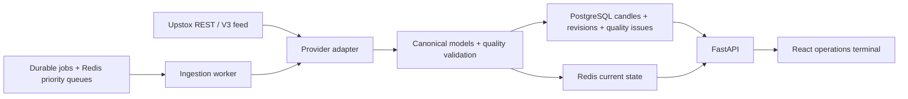

# Architecture — Milestones 0 and 1

The inspected workspace was empty. This build stops at authenticated market-data
ingestion, integrity checks, storage and an operational UI. No signals or orders.

## Proposed repository

```text
stock-intelligence/
  api/                 FastAPI, dependencies, security, routes
  config/              validated environment settings
  market_data/
    providers/         broker-neutral protocol and domain models
    upstox/            REST, OAuth and V3 protobuf adapter
    historical/        ingestion and reconciliation service
    websocket/         reconnecting feed and provisional aggregation
    calendar.py        explicit exchange sessions and overrides
    aggregation.py     complete-minute resampling
    repository.py      transactional persistence
    worker.py          Redis work queues
  migrations/          Alembic revisions, optional Timescale
  frontend/            React, TypeScript, Vite, Tailwind, Lightweight Charts
  tests/               synthetic, contract and integration tests
  docker/              API/frontend images and Nginx
  docs/                design, operations and milestone evidence
```

Later milestones add analysis/{indicators,structure,zones,patterns,candlesticks,
volume,support_resistance,relative_strength}, scanners, strategies, signals,
risk, backtest, portfolio, alerts, events, market_regime, sectors and ai as real
packages with implementations. Empty future packages are intentionally omitted.

## Decisions

* Modular monolith plus ingestion and feed processes; no Kafka or Kubernetes.
* Async HTTP and database I/O; provider DTOs never cross the adapter boundary.
* PostgreSQL is authoritative. Redis stores expiring current state, OAuth state
  and queued jobs. Database jobs remain recoverable if queue publication fails.
* Canonical minute/daily candles use UTC-aware timestamps and decimal prices.
  Session calculations use Asia/Kolkata. Exchange sessions must be explicitly
  supplied; missing calendar dates are unknown, not assumed trading days.
* Provider minute history is authoritative. Sampled feed prices create
  provisional candles only: LTQ is not total traded volume. Reconnects schedule
  REST reconciliation. No unlimited tick persistence.
* Corrections preserve previous values in revision history and carry receipt
  time. Future backtests must query versions available at their simulated time.
* Single-operator deployment in these milestones. Administrative actions require
  a backend API key; broker tokens are Fernet-encrypted in the database. Browser
  credentials are kept in memory only. Multi-user authentication is later work.
* Timescale is optional and enabled only where installed. Regular PostgreSQL is
  supported. Migration ownership is a one-shot service, not every API replica.
* Disabled product areas explicitly identify their milestone. No invented market
  values, indicators, signals or performance statistics appear in the UI.

## Flow




## Multi-provider phase, 2026-09-27

Provider registry, immutable capability descriptors and adapter-owned authentication/transport now route market data. Canonical instrument identity is separate from provider identifiers. See [multi-provider architecture](MULTI_PROVIDER_ARCHITECTURE.md).
